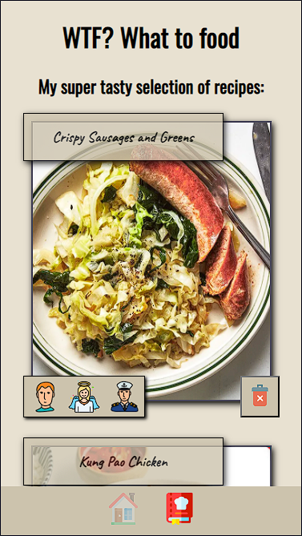
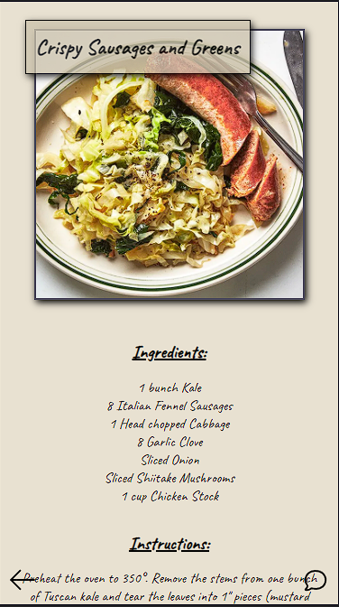
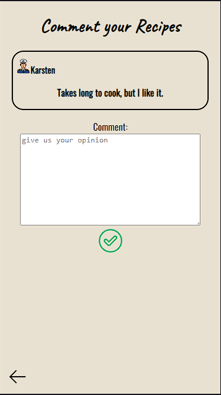

# My Capstone Project: WTF? - What to food

---

WTF? - What to food? is designed to help users discover and cook great new recipes.

Based on the pictures of a recipe, users can choose whether they want to save the recipe or display the next recipe.

All selected recipes appear in the favourites list. In the favourites list, the user can see who else has selected this recipe. This can help to answer the question: what should we eat?

Users also have the option of adding comments to the recipes, e.g. tips for the next preparation.

   

## Demo:

---

You can find the hosted version on [Vercel](https://capstone-project-wtf.vercel.app/)

Important the project is optimized for mobile screen.

## included Tech Stack

---

- React
- React Router
- React Testing Library / Jest
- Next.js
- JavaScript
- Styled Components
- LocalStorage

## How to setup?

---

- Clone this repository
- Install all dependencies with $ npm install
- Run app in dev mode with $ npm run dev
  Server: http://localhost:3000/
- Run tests via $ npm run test
